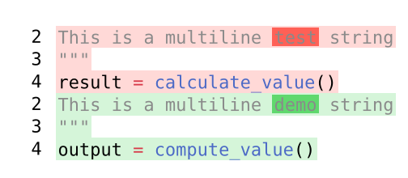

# typst-diff

A Typst-based diff viewer with character-level inline highlighting that **preserves syntax highlighting**.



## Features

- ✨ **Character-precision highlighting** - Highlight specific words or character ranges
- 🎨 **Syntax highlighting preservation** - Colors from Typst's syntax highlighter are maintained
- 📍 **Line range selection** - Show only relevant portions of code
- 🔍 **Multi-token support** - Works across both single-token (strings) and multi-token (code) lines
- 📊 **Multiple highlights per line** - Support for non-overlapping highlight spans

## Quick Start

```typst
#import "state-solution.typ": diff

#diff(
  ```py
  def old_function():
      return 42
  ```,
  ```py
  def new_function():
      return 42
  ```,
  before-inline: (
    (line: 1, start: 4, end: 16, fill: red.transparentize(20%)),
  ),
  after-inline: (
    (line: 1, start: 4, end: 16, fill: green.transparentize(30%)),
  )
)
```

## Key Parameters

### `diff(before, after, ...)`

- **`before`**: Code block (before version)
- **`after`**: Code block (after version)
- **`before-inline`**: Array of `(line: N, start: X, end: Y, fill: color)` for highlighting
- **`after-inline`**: Array of `(line: N, start: X, end: Y, fill: color)` for highlighting
- **`before-range`**: Optional `(start, end)` - Show only specific line range (1-based, inclusive)
- **`after-range`**: Optional `(start, end)` - Show only specific line range (1-based, inclusive)

### Line Numbering

- Line numbers are **1-based** (line 1 is the first line)
- Character positions are **0-based** (character 0 is the first character)
- Ranges are **inclusive** - `(2, 4)` includes lines 2, 3, and 4

## How It Works

The core breakthrough: Typst's styled elements can be reconstructed while preserving their styling:

```typst
styled-elem.func()([#text-slice], styled-elem.styles)
```

This allows us to:
1. Extract the styling function and styles from syntax-highlighted tokens
2. Slice text at any character position
3. Reconstruct styled elements with new content but original colors
4. Wrap highlighted portions in colored boxes

See [`experiments/LEARNINGS.md`](experiments/LEARNINGS.md) for the complete discovery process.

## Examples

Check [`state-solution.typ`](state-solution.typ) for three comprehensive test cases:

1. **Multi-token highlighting** - Keywords and identifiers
2. **Single-token with ranges** - Multiline strings with line selection
3. **Multiple highlights** - Several non-overlapping highlights per line

## Development

See [`CLAUDE.md`](CLAUDE.md) for:
- Testing procedures
- Debugging techniques
- Common tasks
- Architecture details

Quick test:
```bash
typst compile state-solution.typ state-solution.png --format png
```

## Roadmap

### Phase 1: Current Implementation ✅
- Character-level inline highlighting
- Syntax highlighting preservation
- Line range selection
- Basic diff visualization

### Phase 2: Rust/WASM Integration (Planned)
- Integrate [`similar`](https://crates.io/crates/similar) crate for diff algorithm
- Compile to WebAssembly for performance
- Automatic diff calculation from two code blocks
- Smart line matching and alignment
- Hunk-based diff generation

### Phase 3: Advanced Features (Future)
- Side-by-side diff mode
- Word-level diff detection
- Configurable color schemes
- Support for more languages
- Diff statistics and summaries

## Contributing

This project uses a research-driven approach. The `experiments/` directory contains the discovery process. When adding features:

1. Experiment first in `experiments/`
2. Document findings in `LEARNINGS.md`
3. Integrate working solutions into `state-solution.typ`
4. Update tests and documentation

## License

MIT

## Acknowledgments

Built with [Typst](https://typst.app/), leveraging its powerful introspection and styling capabilities.
